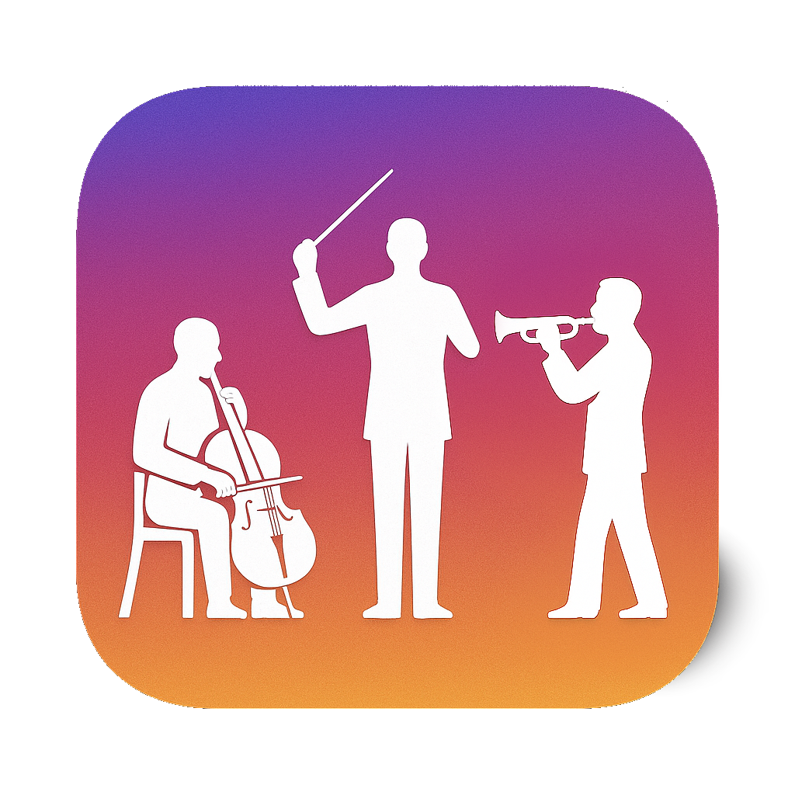

# MusiKe | Juego de los instrumentos de la orquesta

## Descripción

MusiKe es un juego educativo e interactivo diseñado para que usuarios de todas las edades descubran y aprendan los instrumentos de la orquesta a través de divertidos retos y minijuegos.

## Documentación

La documentación técnica completa del proyecto está disponible en el siguiente enlace:

[Documentación MusiKe (PDF)](tex/MusiKe.pdf)

Esta documentación incluye detalles sobre la estructura del proyecto, los recursos utilizados, la arquitectura de la aplicación y las decisiones técnicas implementadas.
